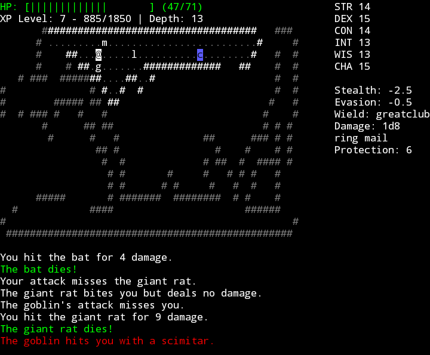

# MyRoguelike2

Game version: `0.16.0` 

This is a terminal-based roguelike game in Python. It entirely uses the CLI interface.
This game does not require any external dependencies besides the Python `curses` module. If you are on Windows, you may need to install the `windows-curses` module.

The game controls can be found in-game.

## How to run the game

1. Install [Python](https://www.python.org/) (must have at least Python 3.11)
2. Download the ZIP file of this repository 
3. Extract the files from the ZIP
4. Run `python3 main.py` to run the game 
